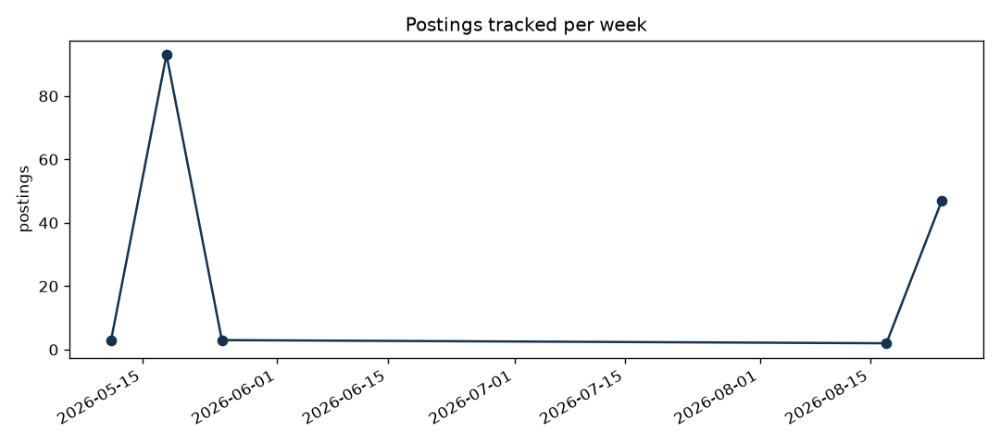
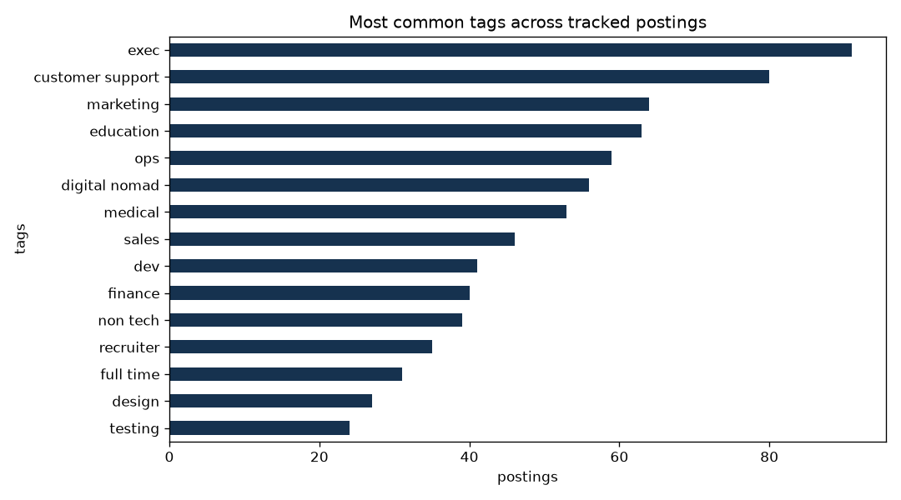

# Job Market Tracker

A fully automated pipeline that tracks the remote job market. Every day a
GitHub Actions workflow fetches the latest postings from the
[RemoteOK](https://remoteok.com) API, stores anything new in a SQLite
database, recomputes the stats and charts below, and commits the result.
Nothing here is updated by hand.

I built this to keep an eye on the market during my own job search, and to
have a project that demonstrates scheduling, ingestion, storage, and
reporting end to end.

## Dashboard

<!-- dashboard:start -->
*Last updated: 2026-08-28 22:53 UTC*

| | |
|---|---|
| Postings tracked | 148 |
| Companies | 130 |
| New since last run | 18 |
| Data/ML-related share | 16% |
| Median advertised max salary | $750,000 |




<!-- dashboard:end -->

## How it works

```
GitHub Actions (daily cron)
  -> src/fetch.py    pull latest postings from the RemoteOK API
  -> src/store.py    insert new postings into data/jobs.db (dedup by id)
  -> src/report.py   recompute stats, regenerate charts, rewrite this README
  -> commit + push   the updated database, figures, and dashboard
```

The database grows a little every day, so the charts get more interesting
the longer the pipeline runs. Runs are idempotent: postings are keyed by id,
so re-running never duplicates data, and the first date a posting was seen
is preserved.

If a run fails, GitHub Actions emails me automatically.

## Running locally

```bash
python3 -m venv .venv && source .venv/bin/activate
pip install -r requirements.txt

python -m src.run     # fetch, store, rebuild the dashboard
python -m pytest      # run the tests
```

## Layout

```
src/
  config.py     paths, API settings, tag definitions
  fetch.py      API client and normalisation
  store.py      SQLite schema and inserts
  report.py     stats, charts, README dashboard
  run.py        entry point
tests/          pytest suite for normalisation and storage
data/jobs.db    the accumulated postings database
.github/workflows/update.yml   the daily schedule
```

Job data comes from the RemoteOK public API.
